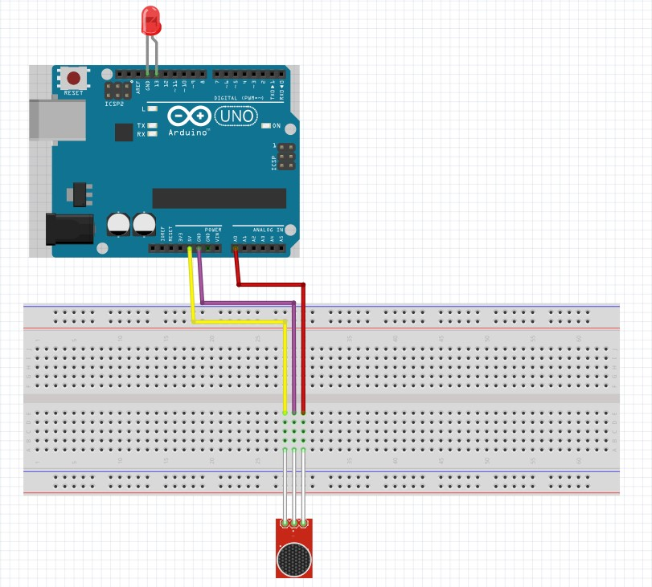

# Jan Piotrowski:
# Projekt czujnika dźwięku oparty o płytkę Arduino
# Zarys działania projektu:
Układ ma za zadanie zapalać i gasić diodę po uderzeniu w stół
# Elementy potrzebne do wykonania projektu:
- płytka Arduino Uno
- płytka stykowa
- dioda LED
- mikrofon
- kable
# Linki do elementów:
- https://allegro.pl/oferta/zestaw-l-arduino-uno-starter-kit-prezent-9924753145
- https://allegro.pl/oferta/czujnik-dzwieku-na-lm393-detektor-halasu-arduino-11393489706?bi_s=ads&bi_m=listing%3Adesktop%3Aqueryandcategory&bi_c=MmZlNzA1MWUtMGVkNy00NzBjLThkNjktOTE4NDE5M2MxMmZmAA&bi_t=ape&referrer=proxy&emission_unit_id=35992ffa-73be-4db0-95af-8c93469315d4
# Schemat płytki w programie Fritzing:

# Zdjęcie przedstawiające fizycznie wykonany projekt:

# Kod programu:
```cpp
int Sensor = A0; //zadeklarowany pin do wyjścia mikrofonu

int clap = 0; //zmienna klaśnięcia
//clap = 0 - brak klaśnięcia
//clap = 1 - potencjalne klaśnięcie
//clap = 2 - potwiedzone klaśnięcie

//zmienne dotyczące sprawdzenia klaśnięcia
long detection_range_start = 0;
long detection_range = 0;
boolean status_lights = false; //status diody
void setup() {
pinMode(Sensor, INPUT); //deklaracja wejścia
pinMode(13,OUTPUT); //deklaracja wyjścia
}
void loop() {
int status_sensor = digitalRead(Sensor); //odczyt z sensora
if (status_sensor == 0) //obsługa klaśnięć
{
if (clap == 0)
{
detection_range_start = detection_range = millis(); //ustalenie czasu klaśnięcia
clap++;
}
else if (clap > 0 && millis()-detection_range >= 50) //potwierdzenie klaśnięcia
{
detection_range = millis();
clap++;
}
}
if (millis()-detection_range_start >= 400) //obsługia diody
{
if (clap == 2) //sprawdzenie czy nastąpiło klaśnięcie
{
if (!status_lights) //sprawdzenie zmiennej diody
{
status_lights = true; //ustawienie zmiennej diody
digitalWrite(13, HIGH); //włączenie diody
}
else if (status_lights)
{
status_lights = false; //ustawienie zmiennej diody
digitalWrite(13, LOW); //wyłączenie diody
}
}
clap = 0;
}
}
```
# Film przedstawiający działanie układu:
https://www.youtube.com/watch?v=pMVKR1Tf7g0

